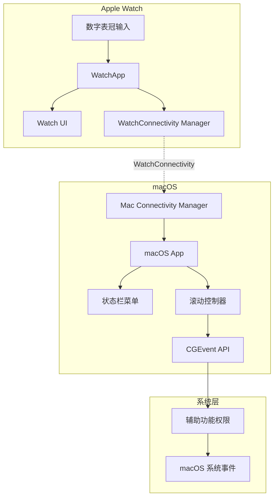

# WatchScroller 应用架构设计

## 总体架构图



## 核心组件设计

### 1. Apple Watch 端 (watchOS)

#### WatchScrollerApp (主应用)
```swift
@main
struct WatchScrollerApp: App {
    var body: some Scene {
        WindowGroup {
            ContentView()
                .environmentObject(WatchConnectivityManager.shared)
        }
    }
}
```

#### ContentView (主界面)
```swift
struct ContentView: View {
    @EnvironmentObject var connectivity: WatchConnectivityManager
    @State private var crownValue = 0.0
    @State private var sensitivity = 1.0
    @State private var isActive = false
    
    var body: some View {
        VStack {
            // 连接状态显示
            ConnectionStatusView(isConnected: connectivity.isConnected)
            
            // 主控制界面
            ScrollControlView(
                crownValue: $crownValue,
                sensitivity: $sensitivity,
                isActive: $isActive
            )
            
            // 设置界面
            SettingsView(sensitivity: $sensitivity)
        }
        .navigationTitle("WatchScroller")
    }
}
```

#### 滚动控制逻辑
```swift
struct ScrollControlView: View {
    @Binding var crownValue: Double
    @Binding var sensitivity: Double
    @Binding var isActive: Bool
    @EnvironmentObject var connectivity: WatchConnectivityManager
    
    var body: some View {
        VStack {
            Button(action: toggleActive) {
                Text(isActive ? "停止控制" : "开始控制")
                    .foregroundColor(isActive ? .red : .green)
            }
            .padding()
            
            Text("滚动值: \(crownValue, specifier: "%.1f")")
                .font(.caption)
        }
        .digitalCrownRotation(
            $crownValue,
            from: -100,
            through: 100,
            by: 0.1,
            sensitivity: .high,
            isContinuous: true
        )
        .onChange(of: crownValue) { newValue in
            if isActive {
                sendScrollCommand(newValue)
            }
        }
    }
    
    private func toggleActive() {
        isActive.toggle()
        // 发送激活/停用状态到 Mac
        connectivity.sendMessage([
            "action": "setActive",
            "active": isActive
        ])
    }
    
    private func sendScrollCommand(_ value: Double) {
        let scrollPixels = value * sensitivity * 10 // 转换为像素值
        connectivity.sendMessage([
            "action": "scroll",
            "pixels": scrollPixels,
            "timestamp": Date().timeIntervalSince1970
        ])
    }
}
```

### 2. macOS 端 (macOS)

#### AppDelegate (应用委托)
```swift
@main
class AppDelegate: NSObject, NSApplicationDelegate {
    var statusItem: NSStatusItem?
    var popover: NSPopover?
    let connectivityManager = MacConnectivityManager.shared
    let scrollController = ScrollController.shared
    
    func applicationDidFinishLaunching(_ aNotification: Notification) {
        setupStatusBarItem()
        setupInitialPermissions()
    }
    
    private func setupStatusBarItem() {
        statusItem = NSStatusBar.system.statusItem(withLength: NSStatusItem.variableLength)
        
        if let button = statusItem?.button {
            button.image = NSImage(systemSymbolName: "scroll.fill", accessibilityDescription: "WatchScroller")
            button.action = #selector(showPopover)
            button.target = self
        }
        
        setupPopover()
    }
    
    private func setupPopover() {
        popover = NSPopover()
        popover?.contentSize = NSSize(width: 300, height: 200)
        popover?.behavior = .transient
        popover?.contentViewController = NSHostingController(
            rootView: MacContentView()
                .environmentObject(connectivityManager)
                .environmentObject(scrollController)
        )
    }
}
```

#### 滚动控制器
```swift
class ScrollController: ObservableObject {
    static let shared = ScrollController()
    
    @Published var isEnabled = false
    @Published var sensitivity: Double = 1.0
    @Published var hasAccessibilityPermission = false
    
    private let throttleQueue = DispatchQueue(label: "scroll.throttle", qos: .userInteractive)
    private var lastScrollTime: CFAbsoluteTime = 0
    private let minimumInterval: CFAbsoluteTime = 0.016 // 60fps
    
    init() {
        checkAccessibilityPermission()
    }
    
    func scrollVertical(pixels: Double) {
        guard hasAccessibilityPermission && isEnabled else { return }
        
        throttleQueue.async { [weak self] in
            guard let self = self else { return }
            
            let now = CFAbsoluteTimeGetCurrent()
            if now - self.lastScrollTime >= self.minimumInterval {
                self.lastScrollTime = now
                
                let adjustedPixels = Int32(pixels * self.sensitivity)
                
                let scrollEvent = CGEvent(
                    scrollWheelEvent2Source: nil,
                    units: .pixel,
                    wheelCount: 1,
                    wheel1: adjustedPixels,
                    wheel2: 0,
                    wheel3: 0
                )
                
                scrollEvent?.post(tap: .cghidEventTap)
            }
        }
    }
    
    private func checkAccessibilityPermission() {
        let options = [kAXTrustedCheckOptionPrompt.takeUnretainedValue(): false]
        hasAccessibilityPermission = AXIsProcessTrustedWithOptions(options as CFDictionary)
    }
    
    func requestAccessibilityPermission() {
        let options = [kAXTrustedCheckOptionPrompt.takeUnretainedValue(): true]
        hasAccessibilityPermission = AXIsProcessTrustedWithOptions(options as CFDictionary)
    }
}
```

#### Mac 连接管理器
```swift
class MacConnectivityManager: NSObject, ObservableObject, WCSessionDelegate {
    static let shared = MacConnectivityManager()
    
    @Published var isConnected = false
    @Published var watchBatteryLevel: Float = 0
    @Published var lastMessageTime: Date?
    
    private let scrollController = ScrollController.shared
    
    override init() {
        super.init()
        setupWatchConnectivity()
    }
    
    private func setupWatchConnectivity() {
        if WCSession.isSupported() {
            WCSession.default.delegate = self
            WCSession.default.activate()
        }
    }
    
    // MARK: - WCSessionDelegate
    func session(_ session: WCSession, activationDidCompleteWith activationState: WCSessionActivationState, error: Error?) {
        DispatchQueue.main.async {
            self.isConnected = (activationState == .activated)
        }
    }
    
    func sessionDidBecomeInactive(_ session: WCSession) {
        DispatchQueue.main.async {
            self.isConnected = false
        }
    }
    
    func sessionDidDeactivate(_ session: WCSession) {
        DispatchQueue.main.async {
            self.isConnected = false
        }
    }
    
    func session(_ session: WCSession, didReceiveMessage message: [String : Any]) {
        DispatchQueue.main.async {
            self.lastMessageTime = Date()
            self.handleWatchMessage(message)
        }
    }
    
    private func handleWatchMessage(_ message: [String: Any]) {
        guard let action = message["action"] as? String else { return }
        
        switch action {
        case "scroll":
            if let pixels = message["pixels"] as? Double {
                scrollController.scrollVertical(pixels: pixels)
            }
        case "setActive":
            if let active = message["active"] as? Bool {
                scrollController.isEnabled = active
            }
        default:
            break
        }
    }
}
```

## 数据流设计

### 1. 用户交互流程
```
用户旋转数字表冠
    ↓
digitalCrownRotation 检测变化
    ↓
计算滚动像素值 (value × sensitivity × multiplier)
    ↓
通过 WatchConnectivity 发送到 Mac
    ↓
Mac 接收消息并解析
    ↓
节流处理防止过频操作
    ↓
CGEvent API 生成系统滚动事件
    ↓
系统分发滚动事件到当前应用
```

### 2. 状态同步机制
```swift
// Watch → Mac 消息类型
enum WatchMessage {
    case scroll(pixels: Double, timestamp: TimeInterval)
    case setActive(Bool)
    case requestStatus
    case updateSensitivity(Double)
}

// Mac → Watch 消息类型
enum MacMessage {
    case status(connected: Bool, permissionGranted: Bool)
    case batteryLevel(Float)
    case error(String)
}
```

## 错误处理和恢复机制

### 1. 连接断开处理
```swift
class ConnectionResilience {
    private var reconnectTimer: Timer?
    private var maxRetryAttempts = 5
    private var currentRetries = 0
    
    func handleDisconnection() {
        startReconnectionTimer()
    }
    
    private func startReconnectionTimer() {
        reconnectTimer?.invalidate()
        reconnectTimer = Timer.scheduledTimer(withTimeInterval: 2.0, repeats: true) { [weak self] _ in
            self?.attemptReconnection()
        }
    }
    
    private func attemptReconnection() {
        guard currentRetries < maxRetryAttempts else {
            stopReconnectionTimer()
            return
        }
        
        currentRetries += 1
        // 尝试重新激活会话
        if WCSession.isSupported() {
            WCSession.default.activate()
        }
    }
}
```

### 2. 权限检查和恢复
```swift
extension ScrollController {
    func monitorPermissionStatus() {
        Timer.scheduledTimer(withTimeInterval: 5.0, repeats: true) { [weak self] _ in
            self?.checkAccessibilityPermission()
        }
    }
}
```

## 性能优化策略

### 1. 消息批处理
```swift
class MessageBatcher {
    private var pendingMessages: [Double] = []
    private var batchTimer: Timer?
    
    func addScrollValue(_ value: Double) {
        pendingMessages.append(value)
        
        if batchTimer == nil {
            batchTimer = Timer.scheduledTimer(withTimeInterval: 0.033, repeats: false) { [weak self] _ in
                self?.flushBatch()
            }
        }
    }
    
    private func flushBatch() {
        let averageValue = pendingMessages.reduce(0, +) / Double(pendingMessages.count)
        // 发送平均值而不是所有单独的消息
        sendScrollMessage(averageValue)
        
        pendingMessages.removeAll()
        batchTimer = nil
    }
}
```

### 2. 内存和电池优化
```swift
// Watch 端省电措施
class PowerManagement {
    func enterLowPowerMode() {
        // 降低更新频率
        // 减少动画效果
        // 暂停非关键功能
    }
    
    func exitLowPowerMode() {
        // 恢复正常功能
    }
}
```

这个架构设计确保了应用的稳定性、性能和用户体验，同时遵循 Apple 的最佳实践。