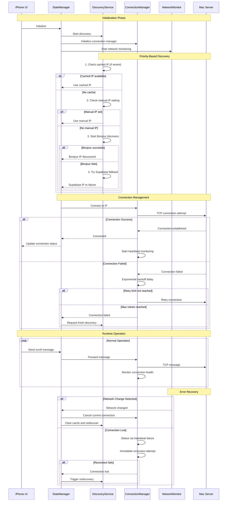

# iPhone-Mac Connection Improvement Plan

## Analysis Summary
The current implementation has complex, intertwined logic with multiple timers, state flags, and discovery methods that can conflict. The code spans 1467 lines with numerous edge cases and redundant paths.

## Proposed Improvements

### 1. **Separate Concerns Architecture**
- **Discovery Service**: Handle IP discovery (Bonjour, Supabase, manual)  
- **Connection Manager**: Handle TCP connection lifecycle
- **Network Monitor**: Handle network change detection
- **State Manager**: Centralize connection state

### 2. **Simplified Discovery Logic**
- Use priority-based discovery: Cached IP → Manual IP → Bonjour → Supabase
- Implement intelligent caching to avoid redundant discoveries
- Single timeout strategy across all discovery methods

### 3. **Robust Connection Management**
- Exponential backoff for connection retries instead of fixed intervals
- Single heartbeat mechanism for connection monitoring
- Graceful degradation when services are unavailable

### 4. **Streamlined Error Handling**
- Unified error categorization (network vs server vs permission errors)
- Consistent retry strategies based on error type
- Prevent timer/resource leaks with proper cleanup

### 5. **Implementation Steps**
1. Create modular service classes while preserving existing API
2. Refactor discovery logic with priority-based approach
3. Implement exponential backoff connection manager
4. Add centralized connection health monitoring
5. Simplify state management with unified coordinator
6. **Ensure iPhone app builds successfully** - validate Xcode project compiles
7. Verify reduced complexity (~800 lines vs current 1467)

## Final Improved Architecture Sequence Diagram

The goal is to improve reliability and maintainability while ensuring the app builds correctly.